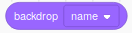
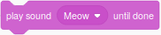
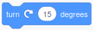
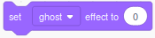
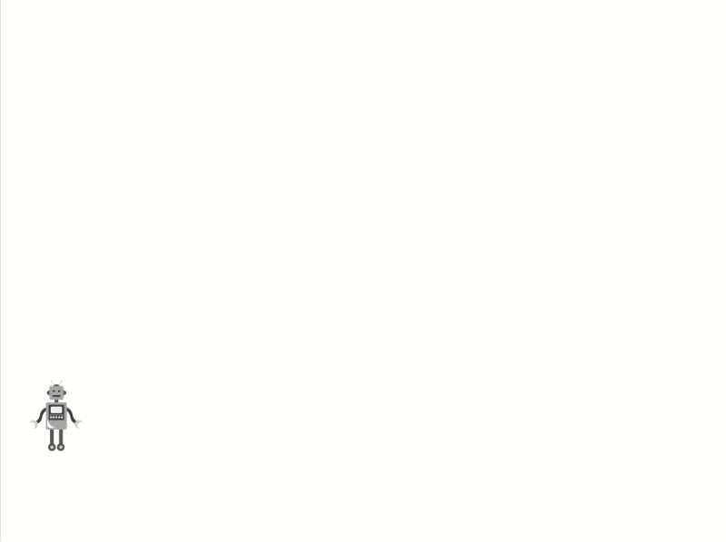
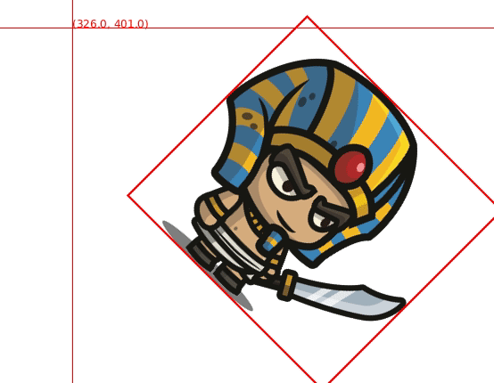

# Processing Library Scratch

To ease the transition from the block-based programming environment
[Scratch](scratch.mit.edu) to [Processing](https://processing.org/) this
library was created. Therefore, the core elements of Scratch are remodeled.

## Elements

### ScratchStage

Usage: `import eu.barkmin.processing.scratch.ScratchStage`

API: https://www.barkmin.eu/processing-library-scratch/reference/eu/barkmin/processing/scratch/ScratchStage.html

Source Code: https://github.com/mikebarkmin/processing-library-scratch/blob/master/src/eu/barkmin/processing/scratch/ScratchStage.java

#### Initialization

Before you can use any of the class provided by this library be sure to
initialize the ScratchStage. You only need to place this statement
`ScratchStage.init(this)` in your setup function. A minimal example could look like this:

```java
import eu.barkmin.processing.scratch.*;

ScratchStage stage;

void setup() {
  ScratchStage.init(this);
  stage = ScratchStage.getInstance();
}

void draw() {
}
```

With `ScratchStage.init(this, true)` you can enable the debug mode. It will display the mouse cursor position and all hitboxes.

#### Looks

| Scratch | Processing |
| :-: | :-: |
|  | `stage.switchBackdrop("backdrop1")` |
|  | `stage.nextBackdrop()` |
|  | `stage.setTint(0)` |
|  | `stage.changeTint(25)` |
|  | `stage.setTransparency(0)` |
|  | `stage.changeTransparency(25)` |
|  | `stage.getCurrentBackdropName()` |
|  | `stage.getCurrentBackdropIndex()` |

To add a new backdrop call `stage.addBackdrop("newBackdrop",
"path/to/newBackdrop.png");`. Afterwards you can switch to the backdrop by calling
`stage.switchBackdrop("newBackdrop");`.

Additionally to the blocks defined in Scratch you can display a text on the screen with: `stage.display("Hi!")`. You can
also display the text for a certain amount of milliseconds like so: `stage.display("Hi", 2000)`.

#### Sensing

| Scratch | Processing |
| :-: | :-: |
|  | `stage.isMouseDown()` |
|  | `stage.getMouseX()` |
|  | `stage.getMouseY()` |
|  | `stage.isKeyPressed(32)` <br> For key pressed you need to use key codes see https://keycode.info/ to find the appropriate one. |
|  | `stage.getCurrentYear()`, `stage.getCurrentDay()`, `stage.getCurrentHour()`, `stage.getCurrentMinute()`, `stage.getCurrentSecond()`, `stage.getCurrentMillisecond()`, `stage.getCurrentDayOfWeek()` |

#### Events

| Scratch | Processing |
| :-: | :-: |
|  | Overwrite `stage.whenKeyPressed(int keycode)`. This method is called every time a key is pressed. See [http://keycode.info](http://keycode.info) for keycode information |
|  | Overwrite `stage.whenMouseMoved(float x, float y)`. This method is called every time the mouse is moved. |

#### Operators

| Scratch | Processing |
| :-: | :-: |
|  | `stage.pickRandom(1, 10)` |


#### Other methods

| Processing | Description |
| :-: | :-: |
| `stage.addSprite(sprite)` | Adds a sprite to stage |
| `stage.removeSprite(sprite)` | Removes a sprite from the stage |
| `stage.removeSprites()` | Removes all sprites |
| `stage.removeSprites(MySprite.class)` | Removes all sprites of class MySprite |
| `stage.getSprites()` | Returns a list of all sprites |
| `stage.getSprites(MySprite.class)` | Returns a list of all sprites of class MySprite |
| `stage.display(String text)` | Displays a text at the bottom of the stage |
| `stage.display(String text, int millis)` | Displays a text at the bottom of the stage for a given amount of milliseconds |

#### Sound

When you work with sound you need to install
[processing-sound](https://processing.org/reference/libraries/sound/) and need
to import the library in your main `.pde` file. `import processing.sound.*;`

| Scratch | Processing |
| :-: | :-: |
|  | `stage.play("Meow");` |
|  | `stage.stopAllSounds();` |

To add a new sound call `stage.addSound("newSound", "path/to/newSound.wav");`.
Afterwards you can play the sound by calling `stage.playSound("newSound");`.

Hint: On my notebook I was not able to play back mp3 files, therefore I
converted them to `wav` files with [SoundConverter](http://soundconverter.org/).

### ScratchSprite

Usage: `import eu.barkmin.processing.scratch.ScratchSprite`

API: https://www.barkmin.eu/processing-library-scratch/reference/eu/barkmin/processing/scratch/ScratchSprite.html

Source Code: https://github.com/mikebarkmin/processing-library-scratch/blob/master/src/eu/barkmin/processing/scratch/ScratchSprite.java

In Scratch sprites are the main actors. Every sprite has a custom set of
costumes and sounds, which could be dynamically changed. Most of the
functionality which sprites in Scratch have were tried to reimplement in
processing. When added to the stage, the run method of a sprite will be called continuously.

#### Creation

```java
import eu.barkmin.processing.scratch.*;

ScratchStage stage;
CatSprite myCat;

void setup() {
  size(800, 600);
  ScratchStage.init(this);
  stage = ScratchStage.getInstance();
  myCat = new CatSprite();
  stage.addSprite(myCat);
}

void draw() {
}

// Define a class Cat
class CatSprite extends ScratchSprite {
  CatSprite() {
    this.addCostume("cat", "sprites/cat.png");
    this.setOnEdgeBounce(true);
  }
  void run() {
    this.move(2);
  }
}
```

#### Motion

| Scratch | Processing |
| :-: | :-: |
|  | `sprite.setX(0);` |
|  | `sprite.changeX(10);` |
|  | `sprite.setY(0);` |
|  | `sprite.changeY(10);` |
|  | `sprite.setPosition(0, 0);` |
|  | `sprite.move(10);` |
|  | `sprite.setRotation(90);` |
|  | `sprite.turnLeft(15);` |
|  | `sprite.turnRight(15);` |
|  | `sprite.getRotation();` |
|  | `sprite.setOnEdgeBounce(true);` |
|  | `sprite.getX();` |
|  | `sprite.getY();` |

#### Looks

| Scratch | Processing |
| :-: | :-: |
|  | `sprite.show();` |
|  | `sprite.hide();` |
|  | `sprite.switchCostume("costume1");` |
|  | `sprite.nextCostume();` |
|  | `sprite.setTint(0);` |
|  | `sprite.changeTint(25);` |
|  | `sprite.setTransparency(0);` |
|  | `sprite.changeTransparency(25);` |
|  | `sprite.setSize(100);` |
|  | `sprite.getCurrentCostumeName();` |
|  | `sprite.getCurrentCostumeIndex();` |
|  | `sprite.getSize();` |
|  | `sprite.say("Hello");` |
|  | `sprite.say("Hello", 2000);`
|  | `sprite.think("Hello");` |
|  | `sprite.think("Hello", 2000);`

To add a new costume call `sprite.addCostume("newCostume",
"path/to/newCostume.png");`. Afterwards you can switch to the costume by calling
`sprite.switchCostume("newCostume");`.

#### Sensing

| Scratch | Processing |
| :-: | :-: |
|  | `sprite.isMouseDown()` |
|  | `sprite.getMouseX()` |
|  | `sprite.getMouseY()` |
|  | `sprite.isKeyPressed(32)` <br> For key pressed you need to use key codes see https://keycode.info/ to find the appropriate one. |
|  | `sprite.getCurrentYear()`, `sprite.getCurrentDay()`, `sprite.getCurrentHour()`, `sprite.getCurrentMinute()`, `sprite.getCurrentSecond()`, `sprite.getCurrentMillisecond()`, `sprite.getCurrentDayOfWeek()` |
|  | `sprite.isTouchingMousePointer()` Pixel-perfect, transparent pixel will be ignored |
|  | `sprite.isTouchingEdge()` based on the default [hitbox](#hitboxes)|
|  | `sprite.isTouchingSprite(anotherSprite)` based on a custom or the default [hitbox](#hitboxes)|

#### Events

| Scratch | Processing |
| :-: | :-: |
|  | Overwrite `sprite.whenKeyPressed(int keycode)`. The method will be called everytime a new KeyEvent is fired. For example when pressing or releasing a key. See [KeyEvent](https://processing.github.io/processing-javadocs/core/processing/event/KeyEvent.html) for more Information. |
|  | Overwrite `sprite.whenMouseMoved(float x, float y)`. The method will be called everytime a new MouseEvent is fired. For example when pressing, releasing or moving the mouse. See [MouseEvent](https://processing.github.io/processing-javadocs/core/processing/event/MouseEvent.html) for more Information. |
|  | Overwrite `sprite.whenClicked()`. |
|  | Overwrite `sprite.whenBackdropSwitches(String name)`. |


#### Operators

| Scratch | Processing |
| :-: | :-: |
|  | `sprite.pickRandom(1, 10)` |

#### Other methods

| Processing | Description |
| :-: | :-: |
| `sprite.run()` | Will be called continuously, when the sprite is added to the stage. |
| `sprite.draw()` | Overwrite this method to gain more control over the sprite and draw it without added it to the stage. |


The following code will show the same result. The normal sprite is handled by the ScratchStage, the custom sprite is handled by us.
```
Custom custom;

void setup () {
  ScratchStage.init(this);
  ScratchStage.getInstance().addSprite(new Normal());
}

void draw() {
  custom.draw();
}

class Normal extends ScratchSprite {
  run() {
    this.move(10);
  }
}

class Custom extends ScratchSprite {
  draw() {
    super.draw();
    this.move(10);
  }
}
```

#### Sound

When you work with sound you need to install
[processing-sound](https://processing.org/reference/libraries/sound/) and need
to import the library in your main `.pde` file. `import processing.sound.*;`

| Scratch | Processing |
| :-: | :-: |
|  | `sprite.play("Meow");` |
|  | `sprite.stopAllSounds();` |

To add a new sound call `sprite.addSound("newSound", "path/to/newSound.wav");`.
Afterwards you can play the sound by calling `sprite.playSound("newSound");`.

Hint: On my notebook I was not able to play back mp3 files, therefore I
converted them to `wav` files with [SoundConverter](http://soundconverter.org/).

### ScratchPen

Usage: `import eu.barkmin.processing.scratch.ScratchPen`

API: https://www.barkmin.eu/processing-library-scratch/reference/eu/barkmin/processing/scratch/ScratchPen.html

Source Code: https://github.com/mikebarkmin/processing-library-scratch/blob/master/src/eu/barkmin/processing/scratch/ScratchPen.java

In Scratch every sprite can use a pen to draw lines, therefore every
ScratchSprite object has an pen associated with it. Through a similar api the
pen can be modified.

| Scratch | Processing |
| :-:     | :-:        |
|  | `sprite.getPen().up();` |
|  | `sprite.getPen().down();` |
|  | `sprite.getPen().setColor(50);` |
|  | `sprite.getPen().changeColor(1);` |
|  | `sprite.getPen().setTransparency(50);` |
|  | `sprite.getPen().changeTransparency(1);` |
|  | `sprite.getPen().setSize(50);` |
|  | `sprite.getPen().changeSize(1);` |
|  | `stage.eraseAll();` |

### ScratchAnimatedSprite

Usage: `import eu.barkmin.processing.scratch.ScratchAnimatedSprite`

API: https://www.barkmin.eu/processing-library-scratch/reference/eu/barkmin/processing/scratch/ScratchAnimatedSprite.html

Source Code: https://github.com/mikebarkmin/processing-library-scratch/blob/master/src/eu/barkmin/processing/scratch/ScratchAnimatedSprite.java

This class inherits form ScratchSprite. Therefore everything you can do with a ScratchSprite, you can also do with a ScratchAnimatedSprite. Additionally you can add animations.

##### Animation

| Method | Description |
| :-: | :-: |
| `sprite.addAnimation("idle", "sprites/pictures_%02d.png", 10)` | This will add a new animation called `idle`. For this animation `10` pictures which match the pattern `sprites/pictures_%02.png` will be loaded. If these pictures are not present an error will occur. The pattern `sprites/pictures_%02d.png` will match `sprites/pictures_01.png`, `sprites/pictures_02.png` and so on. |
| `sprite.playAnimation("idle")` | This will play the animation "idle" repeatedly. |
| `sprite.playAnimation("idle", true)` | This will play the animation "idle" only once. |
| `sprite.isAnimationPlayer("idle")` | This will return a boolean indication if the animation "idle" is fully played. |
| `sprite.resetAnimation()` | This will reset the current animation. |
| `sprite.getAnimationFrame()` | This will return the current animation frame. |
| `sprite.getAnimationInterval()` | This will return the current animation interval. |
| `sprite.setAnimationFrame(10)` | This will set the animation frame to 10. If you only have 6 frames, this will set the animation frame to 4. |
| `sprite.setAnimationInterval(40)` | This will set the animation interval to 40. Lower values mean that the animation will be played faster. |


##### Usage

```java
import eu.barkmin.processing.scratch.*;

ScratchStage stage;
CatSprite myCat;

void setup() {
  size(800, 600);
  ScratchStage.init(this);
  stage = ScratchStage.getInstance();
  myCat = new CatSprite();
  stage.addSprite(myCat);
}

void draw() {
}

// Define a class Cat
class CatSprite extends ScratchAnimatedSprite {
  CatSprite() {
    this.addAnimation("idle", "sprites/cat_idle_%02d.png");
    this.addAnimation("running", "sprites/cat_running_%02d.png")
    this.setOnEdgeBounce(true);
  }
  void run() {
    if(this.isTouchingMousePointer()) {
      this.playAnimation("running");
      this.move(2);
    } else {
      this.playAnimation("idle");
    }
  }
}
```


### Timer

Sometimes you want to trigger an event after a certain time or at a certain time
interval. Therefore, the stage and every sprite have one or more Timer objects.
You can access the timer objects through `stage.getTimer()` or
`sprite.getTimer()`. The timer object has some useful methods:

| API | Example | Description |
| :-: | :-: | :-: |
| `void getMillis()` | `cat.getTimer().getMillis()` | Returns the milliseconds since the sprite was created |
| `boolean everyMillis(int)` | `stage.getTimer().everyMillis(600)` | Returns true every 600 Milliseconds |
| `boolean forMillis(int)` | `dog.getTimer().forMillis(600)` | Returns true for the first 600 Milliseconds |
| `boolean afterMillis(int)` | `cat.getTimer().afterMillis(600)` | Returns true after the first 600 Milliseconds |
| `boolean intervalMillis(int)` | `cat.getTimer().intervalMillis(600)` | Returns toggles between true and false every 600 Milliseconds starting with false |
| `boolean intervalMillis(int, boolean)` | `cat.getTimer().intervalMillis(600, true)` | Returns toggles between true and false every 600 Milliseconds starting with true |
| `boolean intervalMillis(int, int)` | `cat.getTimer().intervalMillis(600, 200)` | Returns toggles between true for 600 Milliseconds and false for 200 Milliseconds starting with false |
| `boolean intervalMillis(int, int, boolean)` | `cat.getTimer().intervalMillis(600, 200, true)` | Returns toggles between true for 600 Milliseconds and false for 200 Milliseconds starting with true |

For a visual example of these methods see example [Timer](#Timer) or the Gif
below. A dot represents the return of true.


```
everyMillis(600) -> orange (first line)
forMillis(600) -> lime (second line)
afterMillis(600) -> green (third line)
intervalMillis(600) -> skyblue (fourth line)
intervalMillis(600, true) -> blue (fifth line)
intervalMillis(600, 300) -> pink (sixth line)
intervalMillis(600, 300, true) -> red (seventh line)
```


If you want that a sprite should do something every 2000ms and every 1000ms,
you need two timers. To add a timer you simply call
`sprite.addTimer("timerForMe")`. The timer is than accessible with `sprite.getTimer("timerForMe")`.

Unfortunately the timer are not on point. Sometimes they are lacking behind.
This happens when the frame rate drops.  This can lead to an unwanted rendering
order. For example the pattern which was tried to achieve in the example
[TimedDot](#TimeDot) should look like this:

Lila, Lila, Green, Lila, Lila, Green, Clear.

Especially at the beginning of the sketch the frame rate increases slowly to
the desired one. Therefore, there are some missing frames in the beginning and
the pattern is messed up. To achieve a better result you should use a multiple
of the frame rate for millis. (If not set the standard frame rate is 60). You
can see the difference below.


| Millis multiple of 100 | Millis multiple of 60 |
| :-: | :-: |
|  |  |

### ScratchSound (internally)

Usage: `import eu.barkmin.processing.scratch.ScratchSound`

API: https://www.barkmin.eu/processing-library-scratch/reference/eu/barkmin/processing/scratch/ScratchSound.html

Source Code: https://github.com/mikebarkmin/processing-library-scratch/blob/master/src/eu/barkmin/processing/scratch/ScratchSound.java

### ScratchImage (internally)

Usage: `import eu.barkmin.processing.scratch.ScratchImage`

API: https://www.barkmin.eu/processing-library-scratch/reference/eu/barkmin/processing/scratch/ScratchImage.html

Source Code: https://github.com/mikebarkmin/processing-library-scratch/blob/master/src/eu/barkmin/processing/scratch/ScratchImage.java

### ScratchText (internally)

Usage: `import eu.barkmin.processing.scratch.ScratchText`

API: https://www.barkmin.eu/processing-library-scratch/reference/eu/barkmin/processing/scratch/ScratchText.html

Source Code: https://github.com/mikebarkmin/processing-library-scratch/blob/master/src/eu/barkmin/processing/scratch/ScratchText.java

### ScratchColor (internally)

Usage: `import eu.barkmin.processing.scratch.ScratchColor`

API: https://www.barkmin.eu/processing-library-scratch/reference/eu/barkmin/processing/scratch/ScratchColor.html

Source Code: https://github.com/mikebarkmin/processing-library-scratch/blob/master/src/eu/barkmin/processing/scratch/ScratchColor.java

Scratch makes it easy to work with colors on the
[hsl](https://en.wikipedia.org/wiki/HSL_and_HSV) color spectrum. To achieve a
similar behavior the class ScratchColor was created.

## Examples

### Cat

Source Code: https://github.com/mikebarkmin/processing-library-scratch/tree/master/examples/Cat

An example with a simple one file setup.


### Robot

Source Code: https://github.com/mikebarkmin/processing-library-scratch/tree/master/examples/Robot

An example with a class in another file.



### Pipes

Source Code: https://github.com/mikebarkmin/processing-library-scratch/tree/master/examples/Pipes

An example with heavy use of the ScratchPen. It also plays an sound file in the background.


### RainbowVine

Source Code: https://github.com/mikebarkmin/processing-library-scratch/tree/master/examples/RainbowVine

An example which makes use of mouse events and timers.


### RandomDot

Source Code: https://github.com/mikebarkmin/processing-library-scratch/tree/master/examples/RandomDot

An example which makes use of timers.


### TimedDot

Source Code: https://github.com/mikebarkmin/processing-library-scratch/tree/master/examples/TimedDot

An example which makes use of timers.


### Timer

Source Code: https://github.com/mikebarkmin/processing-library-scratch/tree/master/examples/Timer

An example which makes use of the many methods of the timer.


### Sensing

Source Code: https://github.com/mikebarkmin/processing-library-scratch/tree/master/examples/Sensing

An example which shows the usage of `isTouchingMousePointer` and custom hitboxes.



### StressTest

Source Code: https://github.com/mikebarkmin/processing-library-scratch/tree/master/examples/StressTest

How many sprites can you display? And how does it effect the frame rate and memory usage of your scratch. Test it with this example.

It also shows how to animate a sprite.


## ColorHit

Source Code: https://github.com/mikebarkmin/processing-library-scratch/tree/master/examples/ColorHit

A little game developed which this library.


## Clock

Source Code: https://github.com/mikebarkmin/processing-library-scratch/tree/master/examples/Clock

Shows the sensing time methods


## Missing

* blocks which are not listed above are currently missing
* sprites can not speak or think

## Advanced Features

### Hitboxes

The default hitbox is defined by the image you have used, but you have the
ability to define a custom hitbox. Therefore, call the method `setHitbox` on the
sprite you would like to modify. The `setHitbox` method gets two arguments
`int[] xPoints` and `int[] yPoints` these correspond to the outline out the new
hitbox. The path will be close automatically.

Example: We set the hitbox of an 615px x 570px image.

```
int[] xHitbox = {0, 300, 300, 0, 150};
int[] yHitbox = {0, 0,   570, 570, 275};
this.setHitbox(xHitbox, yHitbox);
```


## How to install Scratch

### Install with the Contribution Manager

Add contributed Libraries by selecting the menu item _Sketch_ → _Import Library..._ → _Add Library..._ This will open the Contribution Manager, where you can browse for Scratch, or any other Library you want to install.

Not all available Libraries have been converted to show up in this menu. If a Library isn't there, it will need to be installed manually by following the instructions below.

### Manual Install

Contributed Libraries may be downloaded separately and manually placed within the `libraries` folder of your Processing sketchbook. To find (and change) the Processing sketchbook location on your computer, open the Preferences window from the Processing application (PDE) and look for the "Sketchbook location" item at the top.

By default, the following locations are used for your sketchbook folder:
  * For Mac users, the sketchbook folder is located inside `~/Documents/Processing`
  * For Windows users, the sketchbook folder is located inside `My Documents/Processing`

Download Scratch from https://github.com/mikebarkmin/processing-library-scratch/releases/latest

Unzip and copy the contributed Library's folder into the `libraries` folder in the Processing sketchbook. You will need to create this `libraries` folder if it does not exist.

The folder structure for Library Scratch should be as follows:

```
Processing
  libraries
    Scratch
      examples
      library
        Scratch.jar
      reference
      src
```

Some folders like `examples` or `src` might be missing. After Library Scratch has been successfully installed, restart the Processing application.

### Troubleshooting

If you're having trouble, have a look at the [Processing Wiki](https://github.com/processing/processing/wiki/How-to-Install-a-Contributed-Library) for more information, or contact the author [Mike Barkmin](http://barkmin.eu).
