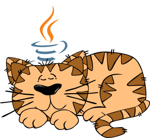

# Scratch for Java



To ease the transition from the block-based programming environment
[Scratch](scratch.mit.edu) to text-based programming in Java this
library was created. Therefore, the core elements of Scratch are remodeled.

- **Documentation**: https://scratch4j.openpatch.org
- **Repository:** https://github.com/openpatch/scratch-for-java
- **Community**: https://matrix.to/#/#openpatch:matrix.org

## Documentation

If you want to work on the documentation, run the
development server and edit the files in the website folder.

```
cd docs
npx hyperbook dev
```

## Library

If you want to work on the library. You need a Java environment and Maven. Then you can use the following command to build
the library.

```
mvn compile
```

You can release the library with the following command:

```
mvn deploy -Pcentral
```

## Running the tutorial projects

`docs/archives` holds a finished project for every tutorial. They are handy for
checking that a change to the library has not broken what the documentation
teaches.

### With Maven, without building a jar

```
mvn -q compile exec:exec -Parchive -Darchive=make-it-walk-100 -Dmain=WalkStage
```

This compiles the chosen project against the library as it stands in your
working copy and runs it in a fresh JVM. The project sources go to their own
output directory, so they can never end up in a released jar.

The finished projects and the class to start are:

| `-Darchive=` | `-Dmain=` |
|---|---|
| `getting-started-100` | `MyStage` |
| `make-it-walk-100` | `WalkStage` |
| `catch-the-coins-100` | `CatchStage` |
| `red-light-green-light-100` | `RaceStage` |
| `guess-the-number-100` | `GuessStage` |
| `bouncy-hedgehog-100` | `BouncyHedgehogStage` |

### With BlueJ or VS Code

Those need a real jar in each project's `+libs` folder:

```
mvn package -Pall -DskipTests
./scripts/link-jar.sh
```

The script links the jar it finds in `target/` into every project under
`docs/archives`, so any of them can be opened directly with BlueJ or VS Code.
It symlinks where it can and copies where it cannot, so it works on Windows too.

**Those jars are for local testing only.** They are git-ignored, and `build.sh`
removes them before the archives are zipped — a jar left in place would put 19 MB
inside every project download.

## Automatic Release Flow

For the automatic release flow you have to commit a changeset. This is a `.md`-file in the `.changeset` directory.

The file needs to have the following structure:

```md
---
type: patch | minor | major
---

A description of the changes made in this release.
```

When a pull request is merged, the changeset will trigger a GitHub action that will create a new pull request with the new version. After this pull request is merged, the new version will be released to Maven Central and Github releases.

## Maintainer

Mike Barkmin • [Mastodon](https://bildung.social/@mikebarkmin) • [GitHub](https://github.com/mikebarkmin/)

## Support

We are [happy to hear from you](mailto:contact@openpatch.org), if you need custom support or features for your application.

---

Scratch for Java is maintained by [OpenPatch](https://openpatch.org), an organization for educational assessments and training. If you need help [get in touch](mailto:contact@openpatch.org).

## Special Thanks

The Scratch for Java library is profiled using [Java Profiler](https://www.ej-technologies.com/products/jprofiler/overview.html)

[](https://www.ej-technologies.com/products/jprofiler/overview.html)
